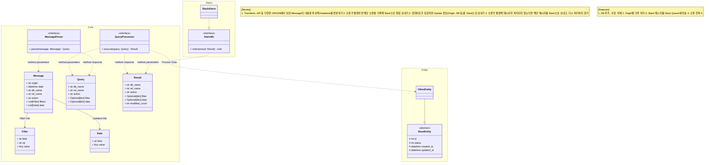

# Pyoniverse Update DB
## Architecture

```mermaid
classDiagram
    note "[Stories]
1. Transform, API 등 다양한 ORIGIN에서 보낸 Message의 내용을 파싱해 Database를 변경하기
2. 오류가 발생하면 해당 오류를 기록해 Slack으로 알림 보내기
3. 업데이트가 성공하면 Update 정보(Origin, DB 등)을 Slack으로 보내기
4. 오류가 발생해 메시지가 처리되지 않는다면 해당 메시지를 Slack으로 보내고, 다시 처리하지 않기"
    note "[Features]
1. DB 추가, 수정, 삭제
2. Origin별 다른 처리
3. Slack 메시지를 Slack Queue에 전송
4. 오류 전파 X"
    namespace Entity {
        class BaseEntity {
            <<abstract>>
            # int id
            # int status
            # datetime created_at
            # datetime updated_at
        }
        class OtherEntity {
        }
    }
    OtherEntity --|> BaseEntity
    namespace Core {
        class QueryProcessor {
            <<interface>>
            + execute(query: Query) Result
        }
        class MessageParser {
            <<interface>>
            + parse(message: Message) Query
        }
        class Message {
            + str origin
            + datetime date
            + str db_name
            + str rel_name
            + str action
            + List[Filter] filters
            + List[Data] data
        }
        class Query {
            + str db_name
            + str rel_name
            + str action
            + Optional[dict] filter
            + Optional[dict] data
        }
        class Result {
            + str db_name
            + str rel_name
            + str action
            + Optional[dict] filter
            + Optional[dict] data
            + int modified_count
        }
        class Filter {
            + str field
            + str op
            + Any value
        }
        class Data {
            + str field
            + Any value
        }
    }
    QueryProcessor ..> OtherEntity: Process Data
    QueryProcessor ..> Query: method parameters
    QueryProcessor ..> Result: method response
    MessageParser ..> Message: method parameters
    MessageParser ..> Query: method response
    Message --> Filter: Filter Info
    Message --> Data: Updated Info

    namespace Alarm {
        class AlarmIfs {
            <<interface>>
            + notice(result: Result) void
        }
        class SlackAlarm {
        }
    }
    AlarmIfs ..> Result: method parameters
    SlackAlarm ..|> AlarmIfs
```
